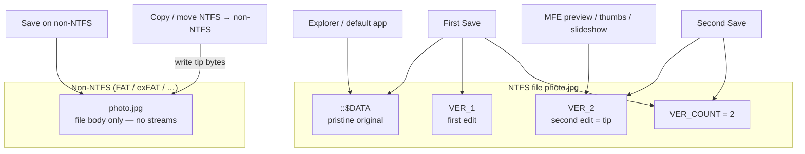

# NTFS Alternate Data Streams (D38)

**Status:** Shipped on Windows / NTFS. Soft-fails off win32, on non-NTFS volumes, and on access errors (empty list / false / null — no hard crash).

NTFS can attach named **alternate data streams** to a file or directory alongside the primary `::$DATA` body. Explorer barely surfaces them; MyFileExplorer exposes list / read / write / delete / import / export without scanning ADS on every folder listing.

Decision lock: [DECISIONS.md](DECISIONS.md) **D38**. IPC: [IPC_CONTRACT.md](IPC_CONTRACT.md) (`ads.*`). Compiled-lists slideshow also stores `Index` / `Count` streams — see [SLIDESHOW.md](SLIDESHOW.md).

## UX

### Details column

- Catalog id: `ads`, label **Alternate streams** (File group).
- **Opt-in** via Details header column menu — not shown by default.
- Filled **asynchronously** through `meta:getMany` when the column is visible (same path as image/A/V columns).
- Value: comma-separated **non-empty stream names** for files **and** folders.
- Primary data stream is omitted.
- After manager edits, main invalidates column meta (`meta:invalidate`) and the Details row refreshes.

Do **not** enumerate ADS inside `fs:list` — that would slow every browse.

### Context menu

**Alternate streams…** on a single file or the current folder opens the ADS Manager for that path.

### ADS Manager

Resizable / draggable dialog (`settings.adsManagerBounds`; null = centered defaults).

| Action | Behavior |
| ------ | -------- |
| List | Name, size, Value preview |
| Add text… | Create/overwrite a named stream with UTF-8 text |
| Edit text… | Load / save text for the selected stream (double-click row) |
| Delete | Confirmed delete of the selected stream |
| Export… | Write stream bytes to a picked file |
| Import… | Read a picked file into a stream (name prompt when adding) |

**Value** column: single-line text shown as-is; multi-line, controls, or binary-looking payloads show `[...]`. Streams larger than 64 KiB skip the text preview for the list (size still shown).

## Path / name rules

Helpers in `src/shared/ads/paths.ts` (Trinet.Core.IO.Ntfs parity, unit-tested without Win32):

- Stream path form: `path:streamName:$DATA`, with `\\?\` when the result is long (`ADS_MAX_PATH`).
- Invalid stream-name chars: `< > : " / \ | ? *` (control chars 1–31 are allowed, matching ADS).
- `BackupRead` names like `:NAME:$DATA` parse to `NAME`; empty / primary → omitted from lists.

## Main process

Single module: `src/main/fs/adsWin32.ts` (koffi → `kernel32` `BackupRead` / `BackupSeek` / `CreateFileW` / `DeleteFileW`).

| Concern | Behavior |
| ------- | -------- |
| List | `BackupRead` stream enumeration |
| Exists / read / write / delete | Open `path:name:$DATA` |
| Text read | UTF-8; trim trailing CR/LF/NUL; cut at first NUL (ADS.cs Load conventions) |
| Text write | Empty value **deletes** the stream unless `writeEmpty` |
| Bytes | Base64 over IPC for import/export |
| Copy | `ads:copy` copies named streams file↔file or dir↔dir (`ignoreNames` optional) |

Normal copy/move of the host file relies on Win32 preserving streams; `ads:copy` is explicit tooling when you need stream-only copy.

Well-known streams such as `Zone.Identifier` appear in the list with **no** special UI. Image-edit history streams `VER_1`…`VER_4` and `VER_COUNT` (D27) are listed like any other stream (binary preview `[...]`); no special hide.

## IPC summary

| Channel | Role |
| ------- | ---- |
| `ads:list` | `{ name, size }[]` |
| `ads:exists` | boolean |
| `ads:readText` / `ads:writeText` | UTF-8 text |
| `ads:delete` | remove named stream |
| `ads:readBytes` / `ads:writeBytes` | binary (base64) |
| `ads:copy` | copy streams between peers |

All paths go through `requireAbsolute` in main. Full request/response shapes: [IPC_CONTRACT.md](IPC_CONTRACT.md).

## Settings

| Key | Meaning |
| --- | ------- |
| `adsManagerBounds` | `{ x, y, width, height }` or `null` for centered defaults |

Column visibility / order live with the rest of the Details layout in settings (see [PROJECT_FORMAT.md](PROJECT_FORMAT.md)).

## Related uses

Compiled file lists (D39) write ADS **`Index`** (image path list) and **`Count`** on `.dat` under the compiled root (Update Lists). `.txt` lists do not use Index ADS. Same NTFS mechanism; slideshow code calls `adsWin32` helpers directly rather than going through the manager UI.

Image-edit history uses `VER_*` / `VER_COUNT` — see below.

## Image edit versions (D27)

In-app Filerobot saves use ADS **only on NTFS**. The default stream (`::$DATA`) is the pristine original; successive edits live in named streams. Decision: [DECISIONS.md](DECISIONS.md) **D27**. Preview UX: [PREVIEW.md](PREVIEW.md).

| Stream | Role |
| ------ | ---- |
| Default (`::$DATA`) | Pristine original — unchanged after the first in-app save |
| `VER_1` … `VER_4` | Successive edits; **higher = newer** (max 4; further saves shift oldest) |
| `VER_COUNT` | Decimal text tip index `1`…`4` |

**Who sees what (NTFS):**

- MFE preview / slideshow / thumbs / editor → tip `VER_{VER_COUNT}`
- Explorer / Open with default app → default stream (original)
- ADS Manager lists `VER_*` / `VER_COUNT` like any other stream (binary preview `[...]`)

**Non-NTFS:** There is no `$DATA` / no ADS — only the file body. Save overwrites that file in place (no warning, no version history).

**Copy / move NTFS → non-ADS volume:** Destination gets the **tip** bytes as the file body (keep the latest edit; original + `VER_*` history cannot travel). NTFS→NTFS relies on normal Win32 copy preserving streams.

**Version Control** (context submenu when `VER_COUNT ≥ 1`): Commit tip into the default stream (preserve other ADS), Revert (drop `VER_*` only), then **Original** / **Version k** items that only switch the preview override. While an override is active, the preview banner offers **Show current** and (for a version, not original) **Drop** with tooltips.

**Legacy migration:** old C# apps that used a single `repaired` ADS can be converted with `scripts/migrate_repaired_ads.bat` (writes `VER_1` + `VER_COUNT=1`, leaves the file body as the original).
