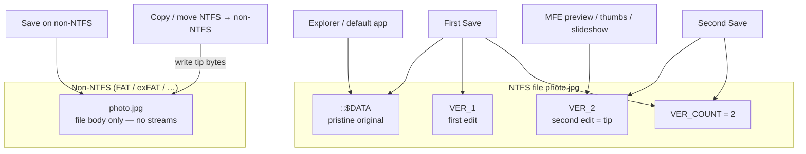

# NTFS Alternate Data Streams (D38)

**Status:** Shipped on Windows / NTFS. Soft-fails off win32, on non-NTFS volumes, and on access errors (empty list / false / null — no hard crash).

NTFS can attach named **alternate data streams** to a file or directory alongside the primary `::$DATA` body. Explorer barely surfaces them; MyFileExplorer exposes list / read / write / delete / import / export without scanning ADS on every folder listing.

Decision lock: [DECISIONS.md](DECISIONS.md) **D38**. IPC: [IPC_CONTRACT.md](IPC_CONTRACT.md) (`ads.*`). Compiled-lists slideshow also stores `Index` / `Count` streams — see [SLIDESHOW.md](SLIDESHOW.md).

## UX

### Details column

- Catalog id: `ads`, label **Alternate streams** (File group).
- **Opt-in** via Details header column menu — not shown by default.
- Filled **asynchronously** through `meta:getMany` when the column is visible (same path as image/A/V columns).
- Value: comma-separated **non-empty stream names** for files **and** folders.
- Primary data stream is omitted.
- After manager edits, main invalidates column meta (`meta:invalidate`) and the Details row refreshes.

**Stream-value columns** (header menu group **Stream values**):

- When the column menu opens, lists unique stream names found on **all entries in the current listing**, plus stream-value columns that are already visible. Tick/untick like other columns. The saved catalog is **not** listed here and is **not** filled from folder scans.
- **...** is the only way to add a catalog entry (optional **Display name** plus **Stream name**). Empty display name uses the stream name.
- **Clear** drops the catalog and hides every stream-value column (all folder views).
- Each enabled stream is catalog id `adsField:<name>`. Settings `adsFieldColumns` only stores streams the user added via **...**.
- Cell: same text preview as the ADS Manager Value column (single-line text; `[...]` if multiline, binary, or larger than 64 KiB; blank if the stream is missing). Reads `path:name:$DATA` only — does not list every stream unless the names column is also visible.

Do **not** enumerate ADS inside `fs:list` — that would slow every browse.

### Context menu

**Alternate streams…** on a single file or the current folder opens the ADS Manager for that path.

### ADS Manager

Resizable / draggable dialog (`settings.adsManagerBounds`; null = centered defaults).

| Action | Behavior |
| ------ | -------- |
| List | Name, size, Value preview |
| Add text… | Create/overwrite a named stream with UTF-8 text |
| Edit text… | Load / save text for the selected stream (double-click row) |
| Delete | Confirmed delete of the selected stream |
| Export… | Write stream bytes to a picked file |
| Import… | Read a picked file into a stream (name prompt when adding) |

**Value** column: single-line text shown as-is; multi-line, controls, or binary-looking payloads show `[...]`. Streams larger than 64 KiB skip the text preview for the list (size still shown).

## Path / name rules

Helpers in `src/shared/ads/paths.ts` (Trinet.Core.IO.Ntfs parity, unit-tested without Win32):

- Stream path form: `path:streamName:$DATA`, with `\\?\` when the result is long (`ADS_MAX_PATH`).
- Invalid stream-name chars: `< > : " / \ | ? *` (control chars 1–31 are allowed, matching ADS).
- `BackupRead` names like `:NAME:$DATA` parse to `NAME`; empty / primary → omitted from lists.

## Main process

Single module: `src/main/fs/adsWin32.ts` (koffi → `kernel32` `BackupRead` / `BackupSeek` / `CreateFileW` / `DeleteFileW`).

| Concern | Behavior |
| ------- | -------- |
| List | `BackupRead` stream enumeration |
| Exists / read / write / delete | Open `path:name:$DATA` |
| Text read | UTF-8; trim trailing CR/LF/NUL; cut at first NUL (ADS.cs Load conventions) |
| Text write | Empty value **deletes** the stream unless `writeEmpty` |
| Host timestamps | ADS write/delete restores NTFS **Creation / Access / Write / Change** times (`SetFileInformationByHandle` `FileBasicInfo`). Node `utimes` only fixes LastWriteTime and leaves **ChangeTime** at now — many sync tools treat that as a file change and recopy. Read-only rips temporarily drop `READONLY` so the restore can succeed. Media-metadata extract/clear wrap all streams on that path in one snapshot. Already-bumped files stay bumped (USN history cannot be undone). |
| Bytes | Base64 over IPC for import/export |
| Copy | `ads:copy` copies named streams file↔file or dir↔dir (`ignoreNames` optional) |

Normal copy/move of the host file relies on Win32 preserving streams; `ads:copy` is explicit tooling when you need stream-only copy.

Well-known streams such as `Zone.Identifier` appear in the list with **no** special UI. Image-edit history streams `VER_1`…`VER_4` and `VER_COUNT` (D27) are listed like any other stream (binary preview `[...]`); no special hide.

**Caption** (UTF-8 JSON): optional array of `{ Caption, Descriptor, Sentence }`. When Settings → Slideshow → **Draw caption** is on, preview / slideshow / image viewer frame the photo in a poster using a random entry; border + titles are colored from a hash of the **entire stream text** (fixed per file, independent of which entry is picked). See [SLIDESHOW.md](SLIDESHOW.md).

**Folder statistics** (UTF-8 decimal integers): optional streams written by folder context menu **Calculate Statistics** (local NTFS folders only). The walk is **depth-first**: every subfolder receives all five streams with immediate counts plus rolled-up totals from its subtree. **Shift+click** runs an incremental pass: a folder that already has a **complete** five-stream record is not entered (stats read from ADS only). When **every direct subfolder** is complete, their totals are read from ADS in batch — those subtrees are not opened. A child with only some streams (interrupted write) is **retagged**, not treated as a fatal error. Write/permission failures show the full path, **Windows Properties**, **Retry** (same root, skip already-tagged folders), **Skip folder** (omit that path and resume), and **Skip all** (omit failures and keep tagging the rest; skipped paths are saved). Manage the list in Settings → Behavior. A tagged parent is therefore instant (no `readdir` under it). The walk **does not enter** Windows system folders (`$RECYCLE.BIN`, `System Volume Information`, the System attribute), or — when the view filter is on — Hidden folders and view-filter pattern matches (same omit rules as the listing). Those children are omitted from counts and are not tagged. The walk does **not** open file contents: sizes come from `FindFirstFile` (`WIN32_FIND_DATA`). The only extra opens are the five statistics ADS writes per folder (serialized, one host-time snapshot). Details columns **Files**, **Total Files**, **Folders**, **Total Folders** (opt-in) read these when present.

| Stream | Meaning |
| ------ | ------- |
| `FileCount` | Files (not folders) in this folder only |
| `FileTotCount` | Files in this folder and all subfolders |
| `FolderCount` | Subfolders in this folder only |
| `FolderTotCount` | Subfolders in this folder and all subfolders |
| `TotalSize` | Total size in bytes of all files under this folder (recursive) |

The standard **Size** column shows `TotalSize` for folders when that stream exists (same B / KB / MB / GB formatting as files). Those ADS reads run only for **visible** folder rows (not the whole listing). Settings → Behavior → **Show folder statistics** (on by default) controls that display and the Files / Folders columns. Off skips those ADS reads so folders show no size; **Calculate Statistics** still writes streams.

## IPC summary

| Channel | Role |
| ------- | ---- |
| `ads:list` | `{ name, size }[]` |
| `ads:listNamesMany` | unique names on many paths (stream-value column dialog) |
| `ads:exists` | boolean |
| `ads:readText` / `ads:writeText` | UTF-8 text |
| `ads:delete` | remove named stream |
| `ads:readBytes` / `ads:writeBytes` | binary (base64) |
| `ads:copy` | copy streams between peers |

All paths go through `requireAbsolute` in main. Full request/response shapes: [IPC_CONTRACT.md](IPC_CONTRACT.md).

## Settings

| Key | Meaning |
| --- | ------- |
| `adsManagerBounds` | `{ x, y, width, height }` or `null` for centered defaults |
| `adsFieldColumns` | `{ stream, label? }[]` — Details **Stream values** catalog (`adsField:<stream>` columns) |

Column visibility / order live with the rest of the Details layout in settings (see [PROJECT_FORMAT.md](PROJECT_FORMAT.md)).

## Related uses

Compiled file lists (D39) write ADS **`Index`** (image path list) and **`Count`** on `.dat` under the compiled root (Update Lists). `.txt` lists do not use Index ADS. Same NTFS mechanism; slideshow code calls `adsWin32` helpers directly rather than going through the manager UI.

**Media metadata (D50)** writes `media_metadata` (JSON), `media_metadata_thumbnail` (cover bytes — not on episode files), and `media_metadata_container` (library + title folder flag). Same NTFS mechanism; not under `userData`. See [MEDIA_METADATA.md](MEDIA_METADATA.md).

Image-edit history uses `VER_*` / `VER_COUNT` — see below.

## Image edit versions (D27)

In-app Filerobot saves use ADS **only on NTFS**. The default stream (`::$DATA`) is the pristine original; successive edits live in named streams. Decision: [DECISIONS.md](DECISIONS.md) **D27**. Preview UX: [PREVIEW.md](PREVIEW.md).

| Stream | Role |
| ------ | ---- |
| Default (`::$DATA`) | Pristine original — unchanged after the first in-app save |
| `VER_1` … `VER_4` | Successive edits; **higher = newer** (max 4; further saves shift oldest) |
| `VER_COUNT` | Decimal text tip index `1`…`4` |

**Who sees what (NTFS):**

- MFE preview / slideshow / thumbs / editor → tip `VER_{VER_COUNT}`
- Explorer / Open with default app → default stream (original)
- ADS Manager lists `VER_*` / `VER_COUNT` like any other stream (binary preview `[...]`)

**Non-NTFS:** There is no `$DATA` / no ADS — only the file body. Save overwrites that file in place (no warning, no version history).

**Copy / move NTFS → non-ADS volume:** Destination gets the **tip** bytes as the file body (keep the latest edit; original + `VER_*` history cannot travel). NTFS→NTFS relies on normal Win32 copy preserving streams.

**Version Control** (context submenu when `VER_COUNT ≥ 1`): Commit tip into the default stream (preserve other ADS), Revert (drop `VER_*` only), then **Original** / **Version k** items that only switch the preview override. While an override is active, the preview banner offers **Show current** and (for a version, not original) **Drop** with tooltips.
