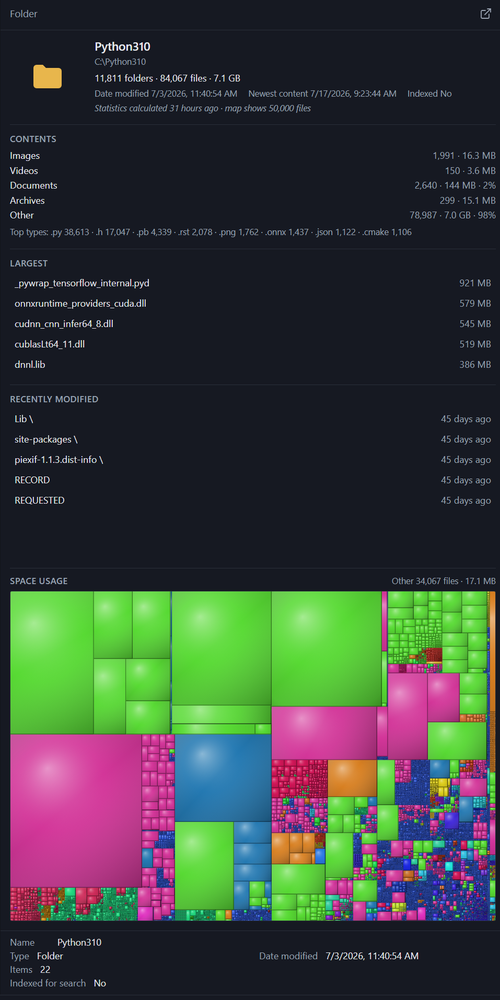

# Folder statistics & space usage

**Version:** 0.15.0 · Decision: [DECISIONS.md](DECISIONS.md) **D66**

**Calculate Statistics** walks a local NTFS folder (or volume root), writes summary streams on that folder and its subfolders, and unlocks a rich **preview card** with a WinDirStat-style **Space usage** map. No sidecars in the browsed tree — data lives in NTFS Alternate Data Streams on each folder. Stream names and write rules: [ADS.md](ADS.md). Preview chrome (Git / Media tabs): [PREVIEW.md](PREVIEW.md).

---

## Screenshot

---

## How to run it

1. Right-click a **local NTFS folder** (or a **drive / volume root** under Drives), or the empty background of that folder.
2. Choose **Calculate Statistics**.
3. Watch the status-bar progress (Cancel stops between folders).
4. Select the folder again (or stay on it) — the preview pane shows the statistics card when `FolderStatsPreview` ADS is present.

Hints on the menu:

| How you invoke it | Menu hint             |
| ----------------- | --------------------- |
| Plain click       | `Shift = skip tagged` |
| **Shift+click**   | `Skip tagged`         |

Remote / non-NTFS paths do not offer Calculate (or soft-fail).

---

## Plain click vs Shift+click

This is the important difference.

|                                             | **Plain click** (full calculate)                                                                           | **Shift+click** (skip tagged)                                                                                                                                                   |
| ------------------------------------------- | ---------------------------------------------------------------------------------------------------------- | ------------------------------------------------------------------------------------------------------------------------------------------------------------------------------- |
| **Intent**                                  | Fresh / complete retag of the tree you clicked                                                             | Incremental update — reuse work already stored on tagged folders                                                                                                                |
| **What gets walked**                        | Depth-first walk of the whole subtree (subject to omit rules below)                                        | Same walk, but a folder that already has a **complete** five-integer set **and** a valid `FolderStatsPreview` (`version: 1`) is **not entered** — totals are read from ADS only |
| **Children that are already tagged**        | Retagged (re-walked)                                                                                       | Skipped as a unit when complete; incomplete / legacy (ints only, no JSON) children are **retagged once**                                                                        |
| **When every direct subfolder is complete** | Still walks / retags as needed                                                                             | Batch-reads child ADS totals — those subtrees are **not** opened                                                                                                                |
| **Volume root (**`Z:\`**, …)**              | Compiles drive stats from root-folder ADS (retagging **untagged** children only) + files on the drive root | Same compile path with **skip tagged** wording — already-tagged root children are not re-walked                                                                                 |
| **Use when**                                | First time on a tree; you changed a lot; you want every map leaf refreshed under that root                 | Most of the tree is already tagged; you only added a few new folders / want a cheap refresh of parents                                                                          |
| **Does not mean**                           | “Only this folder” — subfolders are still tagged                                                           | “Skip this folder” — the folder you clicked is still recalculated (or compiled); **Shift skips already-tagged descendants**                                                     |

**Rule of thumb:** first pass on a library → plain **Calculate Statistics**. Later updates after adding a few titles → **Shift+Calculate Statistics** so tagged show folders are not re-walked.

Progress title reflects the mode (`Calculating statistics…` vs `Calculating statistics (skip tagged)…`, and the drive variants).

---

## What the preview shows

After a successful Calculate, selecting the folder shows a card (not a bare folder icon). Preview **only reads** ADS — it never starts Calculate by itself.

| Section                             | Content                                                                                                                                                                           |
| ----------------------------------- | --------------------------------------------------------------------------------------------------------------------------------------------------------------------------------- |
| **Summary**                         | Folder/file totals · size; host **Date modified** vs **Newest content** (rolled max mtime); “Statistics calculated …” / may be out of date; map leaf count                        |
| **Contents**                        | Category rows (count · bytes · %); top extensions                                                                                                                                 |
| **Largest** / **Recently modified** | Clickable paths (reveal); right-click → Space usage context menu                                                                                                                  |
| **Space usage**                     | Nested cushion treemap of the **largest** files (tile size ∝ bytes, color by extension, hover folder outlines). Remainder: **Other N · size** on the heading — **not** a map tile |

### Map interaction

- **Click** leaf → select / reveal in the file list  
- **Double-click** → open with the default app  
- **Right-click** → Reveal / Open / Cut / Copy / Delete / Delete permanently / Copy path / Properties

Deleting a **file** live-patches tagged ancestor ADS (map updates without Calculate). Deleting a **folder** leaves ancestor stats until the next Calculate.

### Where the card appears

| Context                        | Where to look                                                       |
| ------------------------------ | ------------------------------------------------------------------- |
| Ordinary folder                | Preview pane when selected (or current folder with empty selection) |
| **Git** repo root              | Header **Folder** tab ( **Git** is default)                         |
| Media-tagged show/movie folder | Header **Folder** tab ( **Media** is default)                       |
| **Volume root**                | Free-space pie stays; stats / map appear below when tagged          |

---

## Details columns

When **Settings → Behavior → Show folder statistics** is on (default):

| Column                                                        | Source stream                        |
| ------------------------------------------------------------- | ------------------------------------ |
| **Size** (folders)                                            | `TotalSize`                          |
| **Files** / **Total Files** / **Folders** / **Total Folders** | Integer ADS (opt-in via column menu) |

ADS are read only for **visible** folder rows. Turning the setting **off** hides those values; Calculate still writes streams.

---

## Settings (Behavior)

| Setting                         | Role                                                                                                                                                     |
| ------------------------------- | -------------------------------------------------------------------------------------------------------------------------------------------------------- |
| **Show folder statistics**      | Details Size / Files / Folders from ADS                                                                                                                  |
| **Folder space map max files**  | Max leaf tiles written into `FolderStatsPreview` (100–50000, default **50000**). Changing it does **not** rewrite ADS until the **next plain** Calculate |
| **Folder statistics skip list** | Paths omitted after Skip folder / Skip all during a failed walk                                                                                          |

---

## What the walk skips

Regardless of Shift:

- Windows system folders (`$RECYCLE.BIN`, `System Volume Information`, System attribute)
- When the view filter is on: Hidden folders and view-filter pattern matches (same omit rules as the listing)

Those children are omitted from counts and are not tagged. The walk does **not** open file contents — sizes and times come from directory enumeration (`WIN32_FIND_DATA`). Host Created / Modified on folders are preserved when writing ADS.

On errors: full path, **Windows Properties**, **Retry** (same root, skip already-tagged), **Skip folder** / **Skip all** (paths saved to the skip list).

---

## Streams (summary)

| Stream                           | Role                                   |
| -------------------------------- | -------------------------------------- |
| `FileCount` / `FileTotCount`     | Immediate / recursive file counts      |
| `FolderCount` / `FolderTotCount` | Immediate / recursive subfolder counts |
| `TotalSize`                      | Recursive file bytes                   |
| `FolderStatsPreview`             | JSON for the preview card + space map  |

Full stream table and propagation rules: [ADS.md](ADS.md).

---

## Related

- [ADS.md](ADS.md) — NTFS streams, Calculate write path, columns  
- [PREVIEW.md](PREVIEW.md) — preview pane, Git / Media **Folder** tabs  
- [DECISIONS.md](DECISIONS.md) **D66** — lock  
- [ADVANTAGES.md](ADVANTAGES.md) — vs Explorer / WinDirStat framing

