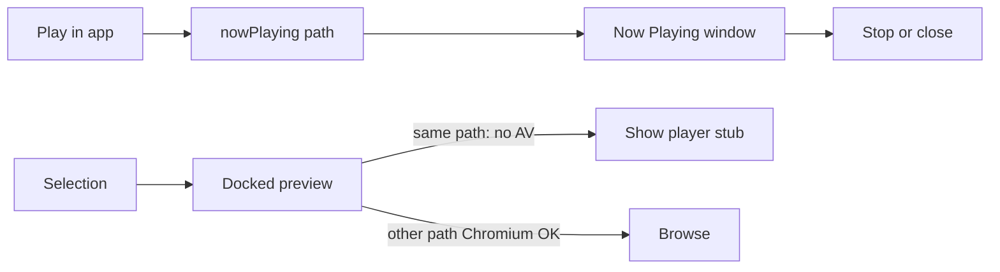

# Now Playing (sticky in-app player) — plan

**Status:** implementing.  
**Surface:** dedicated **Now Playing** `BrowserWindow` — **not** a mini-bar, **not** pin-in-preview.

## Problem

Preview AV (Chromium or Rich Player) is bound to the live selection target. Changing selection or opening another file stops playback. Detached preview still follows selection, so it does not help.

## Product

- **Play in app / Keep playing** on a video starts a sticky session for that path and opens/focuses the Now Playing window.
- **Keep playing** continues from the docked player’s current time (Chromium `currentTime` or mpv `time-pos`); it must not restart from 0.
- That window **does not** receive selection sync.
- Docked preview **keeps following selection** so browsing continues.
- While the session’s path is the preview target, docked AV does not mount (no double playback).
- While Now Playing owns **mpv**, docked Rich Player does not start (one global mpv session).
- Chromium docked preview of a **different** file is allowed.
- Header **Dock** (not a second Close): ends the sticky session and resumes in the docked preview at the current time **only if that file is already the preview target**. Never re-selects or navigates (wrong tab / other folder stays put; toast explains). Title-bar Close stops without resume.
- Delete/rename/move of the playing path stops it (`mediaHold` / `mpvStop` patterns).
- External Open (default app) still stops conflicting in-pane/mpv as today.

## Non-goals (v1)

- Mini-bar / PiP strip
- Playlist / queue / next episode
- Replacing VLC for all codecs (D33 unchanged)

## Architecture

## Anchors

- Mirror [`src/main/preview/previewWindow.ts`](../src/main/preview/previewWindow.ts) as `nowPlayingWindow.ts` without target broadcast from selection.
- Extend [`src/shared/previewAv.ts`](../src/shared/previewAv.ts).
- Entry from video preview chrome ([`PreviewView`](../src/renderer/components/preview/PreviewView.tsx) / Rich / Mpv).
- Spec: amend D14 / [PREVIEW.md](../PREVIEW.md) — docked XOR *preview* detach unchanged; Now Playing is a separate playback-only surface.
