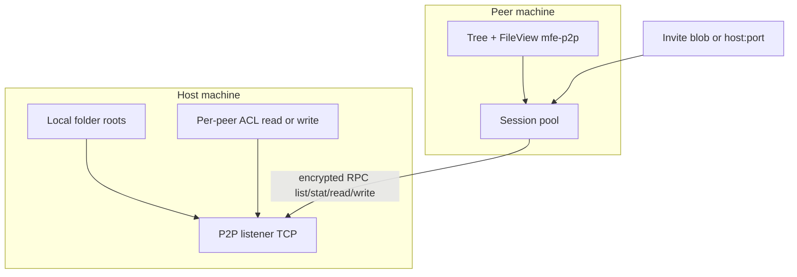

# P2P folder sharing (DEV-gated) — parked plan

**Status:** design locked for implementation; **not** a public product feature yet.  
**Gate:** `isDevGateActive()` / `handleDev` / `devGateActive` (same pattern as compiled lists).  
**Do not** document in README, CHANGELOG, RELEASE_NOTES, or user-facing `docs/` until graduated.

Inspired by [GigaTribe](https://www.gigatribe.com/en/) — invite-only private folder sharing with files staying on disk — but **not** a Gigatribe clone and **not** Microsoft / SMB sharing.

---

## Locked decisions

1. **Connectivity:** LAN-first + invite codes. Join via pasted **invite blob** or **`host:port`**. Optional mDNS later for already-trusted LAN peers. No MFE-operated relay; WAN only if the tester port-forwards.
2. **Access:** Per-user ACL. Peers are **read-only by default**. The share **admin** (host) can elevate individual trusted users to **write** when adding/managing them.

---

## vs Gigatribe (scope)

| Gigatribe | MFE v1 (DEV) |
|-----------|----------------|
| Invite-only private network | Yes — invite blob / `host:port` |
| Share selected folders; files stay on disk | Yes |
| Browse peer tree + download | Yes — feel like local / NAS / remote |
| Two-way sharing (each side can host) | Yes |
| E2E encryption in transit | Yes (Noise or TLS mutual) |
| Central login / presence / paid VPN relay | **No** |
| Multi-source resume / swarm | Deferred |
| Groups + per-folder passwords | Deferred — use **per-peer ACL** instead |
| Microsoft / SMB sharing | **Out** |

**UX goal:** once a share is attached, it appears in the tree and opens with normal FileView / preview / copy — same transparency as Remote repositories (`mfe-remote://…`), not a separate “P2P mode.”

---

## Architecture

### Path scheme

- Opaque locations: `mfe-p2p://{attachmentId}/posix/path`
- Mirror helpers after [`src/shared/remotePaths.ts`](../src/shared/remotePaths.ts); allow in [`src/main/security/paths.ts`](../src/main/security/paths.ts)
- **Do not** overload FTP `mfe-remote://` sessions — separate scheme keeps FS routers and ACL clear

### Main modules (new)

| Module | Role |
|--------|------|
| `src/main/p2p/identity.ts` | Device keypair (Ed25519); persist under `userData/p2p/` |
| `src/main/p2p/invite.ts` | Encode/decode invite blob |
| `src/main/p2p/server.ts` | TCP listen; handshake; RPC |
| `src/main/p2p/acl.ts` | Per-share peer map: `{ peerId, displayName, role: 'read' \| 'write' }` |
| `src/main/p2p/sharesStore.ts` | Hosted shares: local root, name, ACL, listen prefs |
| `src/main/p2p/attachmentsStore.ts` | Client attachments (joined shares) |
| `src/main/p2p/sessionPool.ts` | Connected peers; queue; ops (mirror remotes session pool) |
| `src/main/p2p/scratch.ts` | Temp download for Open / preview |
| `src/main/p2p/protocol.ts` | Versioned RPC: `list`, `stat`, `read`, `mkdir`, `write`, `rename`, `delete`, `ping` |

FS routers: early branch in `list.ts` / `ops.ts` / preview / open / shell (same pattern as remotes). Refuse write RPC/ops when peer role is `read`.

### Invite blob (v1)

Opaque base64url JSON (human-pasteable):

- `v`, `name`, `host` (optional LAN IP/hostname), `port`, `fp` (host pubkey fingerprint), `share` (share id), `token` (capability bound to share)

Also support raw `host:port` + TOFU trust prompt showing fingerprint.

### ACL UX (host)

- **Share folder…** → pick local folder → ensure listener → copy invite
- **Trusted users** on that share: accepted peer identities; default **Read**; toggle **Allow write**
- Revoke drops peer and existing sessions

### Client UX

- Paste invite / enter `host:port` → attachment under tree **Shared folders** (DEV-only chrome)
- Browse / list / copy-out always; paste / upload / rename / delete only if elevated (clear error when read-only)
- Offline / reconnect: status on tree node; soft revalidate like remotes

### Settings / IPC / gate

- Nested prefs on `settingsSchema` only if needed (default listen port, display name) — D45
- Share / attachment / ACL / secrets in sidecars under `userData/p2p/` (never load live settings into model context)
- All IPC via `handleDev(...)` in `register.ts`; renderer chrome on `devGateActive`
- **No** user-facing docs / Settings search entries while unpublished

### Security (v1 hard rules)

- Canonicalize all remote paths under share root (refuse `..` / zip-slip)
- Never follow symlinks out of share root on host
- Encrypt all traffic after handshake; reject unknown peers without invite/token
- Write ops require `role === 'write'`; audit to main log while DEV
- No Windows SMB / Explorer sharing APIs

---

## Implementation phases

### Phase 0 — Spec lock

- This document + Deferred note in DECISIONS (no public D-row product text)

### Phase 1 — Host + invite + read browse

- Identity, listener, invite encode/decode, ACL default read
- `list` / `stat` / `read` + `mfe-p2p://` list / preview / scratch
- Tree + attach / detach UI (DEV); copy invite

### Phase 2 — Write elevate + transparent ops

- Host UI: elevate peer to write
- Client: mkdir / upload / rename / delete when allowed; copy/move into share
- Reuse op progress (D28) where practical

### Phase 3 — Hardening (still DEV-gated)

- Reconnect, resume downloads, optional mDNS, TOFU UX polish
- Fuzz path traversal; two-process integration tests
- Graduate only by explicit product decision

---

## Explicit non-goals (v1)

- MFE cloud accounts, TURN/relay, BitTorrent multi-source
- Per-folder passwords / named groups (use per-peer elevate)
- Microsoft SMB / changing Windows share settings
- User-facing documentation while unpublished

---

## Integration anchors (existing code)

- Remotes UX/FS pattern: [`docs/REMOTE_FTP.md`](../REMOTE_FTP.md), [`src/main/remote/sessionPool.ts`](../src/main/remote/sessionPool.ts), [`src/shared/remotePaths.ts`](../src/shared/remotePaths.ts)
- DEV gate: [`src/main/devGate.ts`](../src/main/devGate.ts), `handleDev` in [`src/main/ipc/register.ts`](../src/main/ipc/register.ts)
- Do **not** reuse Network SMB discovery ([`docs/NETWORKS.md`](../NETWORKS.md)) for P2P peers
